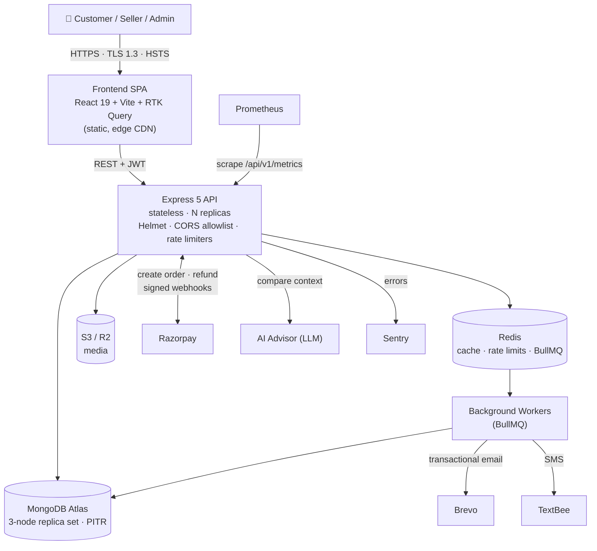
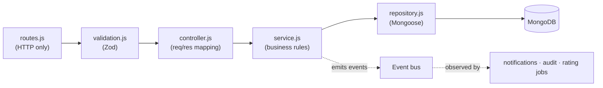
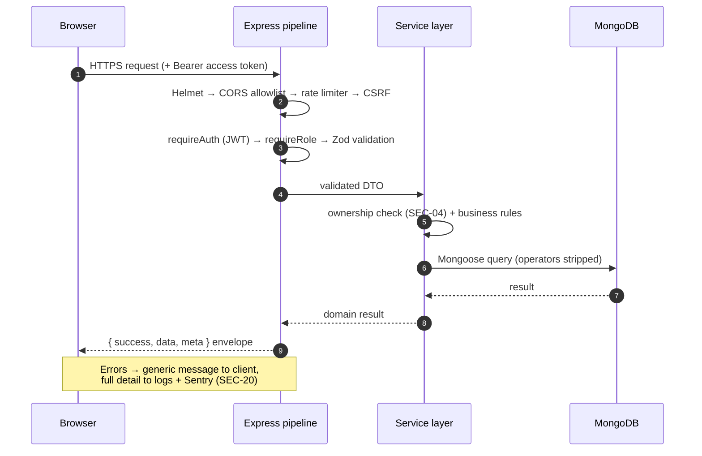
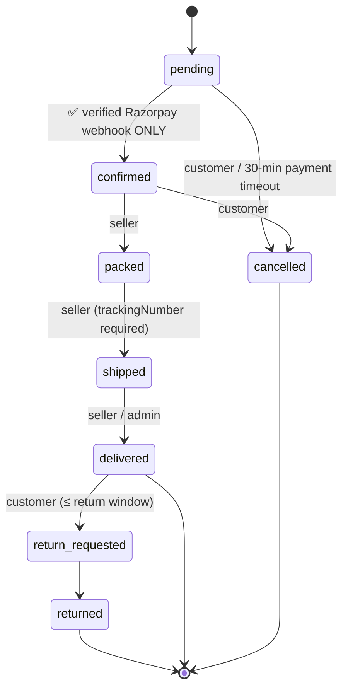
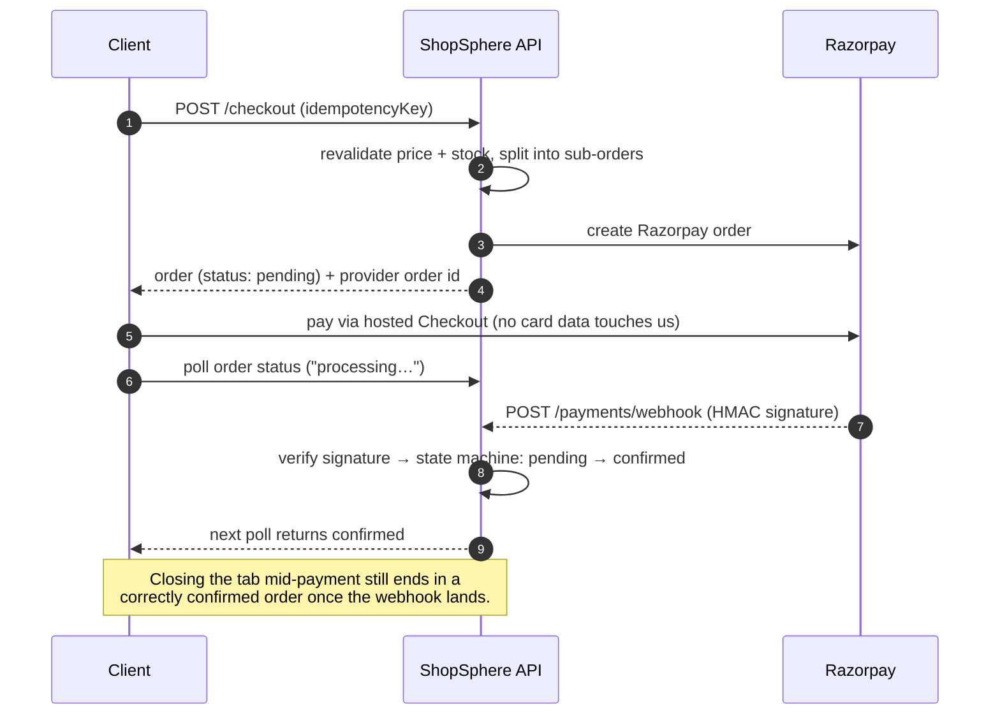
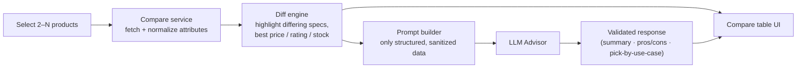

<div align="center">

# 🛒 ShopSphere

### A production-patterned, multi-seller e-commerce marketplace with an AI-powered product comparison advisor

[](https://nodejs.org)
[](https://react.dev)
[](https://expressjs.com)
[](https://www.mongodb.com/atlas)
[](https://redis.io)
[](https://razorpay.com)
[](#8-testing--verification)
[](./SECURITY_AUDIT_REPORT.md)
[](./LOAD_TEST_REPORT.md)
[](#16-license)

**Customer · Seller · Admin** — one platform, three role-gated experiences, one immutable order state machine.

[Features](#3-feature-matrix) · [Architecture](#5-architecture) · [Quickstart](#7-local-setup) · [Security](#9-security-model) · [Performance](#10-performance) · [Roadmap](#14-known-limitations--roadmap)

</div>

---

## 1. What is ShopSphere?

ShopSphere is a full-stack **multi-vendor marketplace** (Amazon-style) covering the entire commerce loop: discovery, cart, checkout, payment, multi-seller fulfilment, reviews, seller analytics, and platform administration.

It is deliberately engineered like a real system rather than a tutorial app:

- **Webhook-driven payment truth.** The browser never decides whether an order is paid. Only a signature-verified Razorpay webhook can move an order from `pending` to `confirmed`.
- **One checkout, many sellers.** A single cart is split into per-seller **sub-orders**. Each seller sees and manages only their own slice, while the customer sees one unified order.
- **A single-source-of-truth state machine.** No code path assigns `order.status = X` directly. Every transition goes through `orderStateMachine.js`, which emits events that other modules observe.
- **Defense in depth.** Rotating refresh tokens with reuse detection, step-up re-auth for admins, application-layer encryption for 2FA secrets, an append-only audit log, and an IDOR test matrix.
- **A comparison engine with an AI advisor.** Shoppers compare products side by side and get a contextual AI recommendation based on the structured spec data.

> **Design stance:** the scope is intentionally cut to something one engineer can build *and defend*. Anything not built (ML recommendations, multi-currency, carrier APIs) is documented as out of scope rather than faked. See [Known Limitations](#14-known-limitations--roadmap).

---

## 2. Why it's worth a look (Advantages & Benefits)

| For | Benefit | How it is achieved |
|---|---|---|
| **Customers** | Trustworthy prices, reviews and payment | Server-side price/stock revalidation at checkout. Reviews are gated by a *delivered* purchase. Payment confirmation comes from the provider webhook, not the client redirect. |
| **Customers** | Faster, smarter purchase decisions | Side-by-side **Compare** view with an **AI Advisor** that explains trade-offs. |
| **Sellers** | Real tooling, not a toy dashboard | Per-SKU inventory with low-stock flags, revenue and top-product analytics, CSV bulk upload, and review responses. |
| **Sellers** | Hard data isolation | Object-level authorization on every route (SEC-04), verified by an automated test matrix. |
| **Admins** | Governance with accountability | Suspend, moderate and refund actions are step-up protected and written to an append-only `AuditLog`. |
| **Engineers** | Safe to extend | Feature-per-module layout. Later phases *reference* earlier models by ID and never edit them. |
| **Operators** | Debuggable in production | Prometheus metrics, Sentry with PII redaction, structured security logging, and a deployment runbook with rollback. |
| **Everyone** | Resilience | Idempotent checkout, retry-safe Mongo writes, graceful degradation when third parties fail. |

---

## 3. Feature Matrix

### Customer
- Email/password registration with verification, and Google OAuth2
- Hierarchical category browse (max depth 3), cursor-paginated listings
- Typo-tolerant search with faceted filters (price, brand, rating, attributes)
- Guest carts (signed cookie) that merge into the user cart on login
- 4-step checkout: cart → address → payment → confirm (**NFR-UX-02**)
- Coupons validated server-side (expiry, usage limit, minimum cart value)
- Order history, live status, and cancellation while `pending` or `confirmed`
- Verified-purchase reviews with photos, helpful votes, and seller replies
- "Customers also bought" via co-purchase frequency
- In-app notification centre, plus transactional email and SMS
- **Product Compare + AI Advisor** (see [§6](#6-deep-dive-product-compare--ai-advisor))

### Seller
- Seller application and onboarding (KYC-lite schema, extensible)
- Product CRUD restricted to owned products, with S3/R2 image upload validated by MIME and magic bytes
- CSV bulk upload, per-SKU inventory, and low-stock alerts
- Analytics: revenue over time, top products, order volume
- Fulfilment: mark packed or shipped, with tracking number

### Admin
- User and seller suspend/reinstate, and listing moderation
- Platform metrics (GMV, order volume, active users, top categories)
- Audit log viewer
- TOTP 2FA is **mandatory** for admin roles, and sensitive actions require step-up re-auth

---

## 4. Tech Stack

| Layer | Technology | Rationale |
|---|---|---|
| **Frontend** | React 19, Vite, Redux Toolkit + **RTK Query**, React Router 7, Tailwind CSS, Recharts | RTK Query provides cache invalidation and request dedup. Vite HMR keeps iteration fast. |
| **Backend** | Node.js 20 LTS, Express 5, Mongoose 9, Zod | A layered architecture compensates for Express being unopinionated. Zod is the server-side validation boundary. |
| **Database** | MongoDB Atlas (3-node replica set) | The document model suits catalog and variant data. Atlas provides managed HA and PITR backups. |
| **Cache / Queue** | Redis, BullMQ (in-memory fallback for local dev) | One technology serves caching, rate-limit storage and background jobs. |
| **Search** | MongoDB Atlas Search | Typo tolerance and relevance scoring without running a separate Elasticsearch cluster. |
| **Payments** | **Razorpay** (hosted checkout, HMAC-verified webhooks) | PCI scope stays at SAQ-A because no raw card data touches the server. |
| **Email** | **Brevo** (transactional) | Deliverability, templates and bounce handling. |
| **SMS** | **TextBee** | Lightweight SMS for OTP and delivery events, behind a provider-agnostic interface. |
| **Media** | S3 / Cloudflare R2 + CDN transforms (WebP, `srcset`) | Stateless app servers, with no local disk. |
| **Security** | bcrypt, jsonwebtoken, otpauth (TOTP), Node `crypto` (AES-256-GCM), Helmet, express-rate-limit | Vetted libraries, with no hand-rolled primitives. |
| **Observability** | Prometheus exposition, Sentry | Latency percentiles, error rate and alert rules. |
| **Testing** | Node native test runner (`node --test`), `assert/strict` | No test-framework dependency. 136 tests. |

---

## 5. Architecture

### 5.1 High-level system context



### 5.2 Backend layering (low-level)

Every feature is a self-contained module. Business logic never lives in route handlers and never touches `req`/`res`.

```
server/src/
├── config/          env loading, Mongo + Redis connections
├── middleware/      auth · rbac · rateLimiter · validator · errorHandler · csrf · stepUp
├── shared/          response envelope · logger · cache · cdn · email · sms · securityLogger
└── modules/
    ├── auth/        routes → controller → service → repository
    ├── users/       (addresses, sellerProfile, 2FA)
    ├── products/
    ├── cart/
    ├── orders/      order.model · orderStateMachine (pure) · checkout service
    ├── payments/    Razorpay client · webhook handler · refunds
    ├── reviews/
    ├── notifications/   (observer: listens to state-machine events)
    ├── compare/     (compare engine + AI advisor)
    ├── seller/      (analytics, inventory, CSV import)
    ├── admin/
    └── audit/       append-only AuditLog
```



**Isolation principle:** later modules reference earlier ones by `ObjectId`, never by importing their models. Cross-cutting middleware (auth, RBAC, rate limiting, error handling) is written once and *used*, not modified. Every edit to an earlier-phase file is recorded in the Amendments Log in [`ShopSphere_Phase_Plan.md`](./ShopSphere_Phase_Plan.md).

### 5.3 Request lifecycle



### 5.4 Data model (embed vs reference)

| Collection | Key design decisions |
|---|---|
| **User** | Addresses are **embedded** (small, bounded, always read with the user). `twoFactorSecret` is AES-256-GCM encrypted. `sellerProfile` is an additive subdocument. |
| **Product** | Variants (SKU, price, stock, images) are **embedded** because they are bounded and always read together. `ratingAvg` and `ratingCount` are cached and recomputed asynchronously. A compound index on `{category.l1, category.l2, status, ratingAvg}` serves filtered browse. |
| **Order** | `subOrders[]` are keyed by seller. Item prices and the shipping address are **immutable snapshots**, never re-read live. A unique index on `idempotencyKey` guards against double submits. A `{customerId, createdAt:-1}` index serves history. |
| **Review** | **Referenced** (unbounded growth). It carries `orderId` as proof of verified purchase. |
| **Cart** | A sparse `userId` supports guest carts. A TTL index auto-expires abandoned guest carts. |
| **AuditLog** | Append-only. Stores actor, action, target, IP and user agent. Indexed on `createdAt`. |

### 5.5 Order state machine



- A pure module, `orderStateMachine.js`, is the **only** mutator of status.
- Transitions emit events. The **notification module** (Brevo email, TextBee SMS, in-app) and the **audit module** subscribe, so the state machine is never edited to add side effects.
- Any state can be moved to `refunded` by an admin, always with an `AuditLog` entry.

### 5.6 Payment flow (Razorpay, webhook-authoritative)



---

## 6. Deep Dive: Product Compare + AI Advisor

The comparison module lets a shopper pick products and view a normalized, side-by-side spec table. An **AI Advisor** then reasons over that structured data to explain the trade-offs.



**Design principles**

1. **Grounded, not freeform.** The advisor sees only structured product data (title, price, attributes, `ratingAvg`, stock). It does not browse or invent specs.
2. **Server-side only.** The LLM key never reaches the browser. The endpoint sits behind the same auth, rate-limit and validation stack as everything else.
3. **Injection-aware.** Seller-authored text such as descriptions is treated as untrusted input and is sanitized and delimited in the prompt.
4. **Fails soft.** If the advisor times out or errors, the deterministic compare table still renders. This follows **NFR-AVAIL-04**, where an integration failure degrades the feature rather than blocking the page.
5. **Cost-bounded.** Responses are cacheable per product-set and are rate limited per user.

---

## 7. Local Setup

### Prerequisites
- **Node.js ≥ 20**
- **MongoDB**: local (`mongodb://127.0.0.1:27017/shopsphere`) or an Atlas URI
- *(Optional)* Redis. Without it, the cache and rate limiter fall back to in-memory, which is fine for development.
- Sandbox accounts for **Razorpay**, **Brevo** and **TextBee**. They are optional for browsing, but required to exercise payments, email and SMS.

### 1. Clone and install
```bash
git clone <your-repo-url> shopsphere && cd shopsphere

cd server && npm install
cd ../client && npm install
```

### 2. Configure environment
```bash
cp server/.env.example server/.env
cp client/.env.example client/.env
```

**`server/.env`** (verify the variable names against your `.env.example`)
```env
NODE_ENV=development
PORT=5000
CLIENT_URL=http://localhost:5173
CORS_ORIGINS=http://localhost:5173

# Database
MONGODB_URI=mongodb://127.0.0.1:27017/shopsphere
REDIS_URL=redis://127.0.0.1:6379          # optional

# Auth: generate each with: node -e "console.log(require('crypto').randomBytes(32).toString('hex'))"
JWT_SECRET=<64-hex>
JWT_REFRESH_SECRET=<64-hex>
TWO_FA_ENCRYPTION_KEY=<64-hex>            # AES-256-GCM key for TOTP secrets

# Razorpay (test mode)
RAZORPAY_KEY_ID=rzp_test_xxxxxxxx
RAZORPAY_KEY_SECRET=xxxxxxxx
RAZORPAY_WEBHOOK_SECRET=xxxxxxxx

# Brevo (email)
BREVO_API_KEY=xkeysib-xxxxxxxx
EMAIL_FROM=no-reply@yourdomain.com

# TextBee (SMS)
TEXTBEE_API_KEY=xxxxxxxx
TEXTBEE_DEVICE_ID=xxxxxxxx

# AI Advisor
AI_API_KEY=xxxxxxxx

# Observability (optional)
SENTRY_DSN=
LOG_LEVEL=debug
```

**`client/.env`**
```env
VITE_API_URL=http://localhost:5000/api/v1
VITE_RAZORPAY_KEY_ID=rzp_test_xxxxxxxx
```

> 🔐 Never commit `.env` files. Use fresh random secrets per environment, and never reuse the sample values from any document.

### 3. Run
```bash
# Terminal 1: API on :5000
cd server && npm start

# Terminal 2: SPA on :5173
cd client && npm run dev
```
Open **http://localhost:5173**. Health check: `GET http://localhost:5000/api/v1/health`.

### 4. Test Razorpay webhooks locally
Razorpay must reach your machine to confirm orders. Expose the API with a tunnel (for example `ngrok http 5000`), then register
`https://<tunnel>/api/v1/payments/webhook` in the Razorpay dashboard with the same secret as `RAZORPAY_WEBHOOK_SECRET`. Use Razorpay's test card or UPI sandbox flows.

### Troubleshooting

| Symptom | Likely cause |
|---|---|
| Order stuck on "processing" | Webhook is not reaching the server (tunnel URL or secret mismatch). |
| CORS errors in the browser | `CORS_ORIGINS` must exactly match the SPA origin, with no wildcard. |
| Login loop after refresh | Refresh cookie is `Secure` + `SameSite=Strict`. Use `localhost`, not a LAN IP. |
| Rate-limited during testing | `authLimiter` allows 5 requests per 15 minutes. Wait, or restart with in-memory limits. |

---

## 8. Testing & Verification

```bash
cd server
npm test                        # 136 tests (unit + integration + security + E2E journeys), with coverage
node scripts/security-audit.js  # OWASP / control scanner
node scripts/load-test.js       # concurrency + latency benchmark

cd ../client && npm run build   # verify production bundle
```

| Suite | What it proves |
|---|---|
| **IDOR matrix** (`idor.matrix.test.js`) | User A cannot read or write User B's products, orders, reviews, carts or addresses. |
| **Auth** | Register → verify → login → refresh → logout. Replayed refresh tokens revoke the whole family. |
| **Checkout** | Duplicate submits create exactly one order. Tampered client prices are rejected or corrected. |
| **Payments** | Webhook-only confirmation, with signature verification. |
| **Reviews** | Non-purchasers get a 403. |
| **Service-layer coverage** | ≥ 70% target (NFR-MAINT-03). Auth and users services reached 100% line coverage. |

---

## 9. Security Model

Aligned to the OWASP Top 10 and ASVS. The principle is **defense in depth**, not "unhackable".

| Control | Implementation |
|---|---|
| **SEC-01** Password hashing | bcrypt, cost 12 |
| **SEC-02/03** Sessions | 15-minute access token held **in memory only**. 7-day rotating refresh token in an `httpOnly` `Secure` `SameSite=Strict` cookie, with **token-family reuse detection**. |
| **SEC-04** IDOR / object-level authz | Ownership enforced in the service layer on every route, covered by an automated matrix. |
| **SEC-05/16** Rate limiting | `authLimiter` 5 requests per 15 minutes. `apiLimiter` 100 requests per 15 minutes. |
| **SEC-06** Step-up auth | A short-lived elevated token for suspend and refund actions. |
| **SEC-07–10** Input safety | Zod schemas, Mongo operator stripping (`sanitizeMongoQuery`), regex escaping (`escapeRegex`), and upload MIME + magic-byte checks. |
| **SEC-11–13** Transport and headers | TLS, HSTS (1 year, preload), Helmet CSP, `X-Frame-Options: DENY`, `nosniff`. |
| **SEC-12** CORS | Explicit origin allowlist, no wildcard. |
| **SEC-17** Data at rest | AES-256-GCM application-layer encryption of TOTP secrets. |
| **SEC-18** PCI scope | Hosted Razorpay checkout. Raw card data never reaches the server. |
| **SEC-20** Safe errors | Generic client message, with full detail in logs and Sentry (PII redacted). |
| **SEC-21/22** Audit and detection | Append-only `AuditLog`. Structured security logging for auth failures, 403s and rate-limit trips. |
| **SEC-23** Policy | [`SECURITY.md`](./SECURITY.md) covers disclosure, patch SLAs and secret-rotation owners. |

Latest automated audit: **0 High/Critical findings**. See [`SECURITY_AUDIT_REPORT.md`](./SECURITY_AUDIT_REPORT.md).

---

## 10. Performance

Benchmarked at **100 concurrent virtual users** (150 requests, 0 server errors):

| Operation | p50 | p95 | p99 | Target (p95) | Result |
|---|---|---|---|---|---|
| Read (browse / health / metrics) | 241 ms | **292 ms** | 296 ms | < 300 ms | ✅ |
| Write (cart / checkout) | 106 ms | **111 ms** | 112 ms | < 600 ms | ✅ |

Supporting design choices:
- **Cursor-based pagination** (≤ 24 items per page), not offset, so deep pages stay fast.
- **Redis cache** for the category tree and other read-heavy, rarely changing data (NFR-PERF-03).
- **Async side effects** (email, SMS, rating recomputation, indexing) run on BullMQ and stay off the request path.
- **Responsive images** are served through CDN transforms (WebP + `srcset`).

Full report: [`LOAD_TEST_REPORT.md`](./LOAD_TEST_REPORT.md).

---

## 11. Observability

- `GET /api/v1/health`: liveness
- `GET /api/v1/metrics`: Prometheus format, with p50/p95/p99 latency and error rate
- Alert rules for error-rate spikes (> 5%), payment-webhook failures, and auth-failure spikes
- Sentry on both frontend and backend, with PII redaction at the global error handler

---

## 12. API at a Glance

All routes are versioned under `/api/v1` and return a consistent envelope:
`{ success: true, data, meta }` or `{ success: false, error: { code, message, details } }`. The full contract is in [`docs/openapi.yaml`](./docs/openapi.yaml).

| Area | Representative endpoints |
|---|---|
| Auth | `POST /auth/register` · `/login` · `/refresh` · `/logout` · `GET /auth/sessions` |
| Catalog | `GET /products` · `GET /products/:id` · `GET /categories` |
| Cart & checkout | `GET/POST/PUT/DELETE /cart` · `POST /checkout` |
| Payments | `POST /payments/create-intent` · `POST /payments/webhook` · `POST /payments/:orderId/refund` |
| Orders | `GET /orders` · `GET /seller/orders` · `PUT /seller/orders/:id/status` |
| Reviews | `POST /reviews` |
| Seller | `GET /seller/analytics` · `POST /sellers/apply` |
| Admin | `/admin/*` (RBAC + step-up gated) |

---

## 13. Deployment

Production topology (single-region, per SRS 2.6): SPA on Vercel/Netlify/Cloudflare Pages, stateless API on Render/Railway/App Runner, MongoDB Atlas M10+ (3-node replica set, continuous PITR backups, RTO under 15 minutes), and Redis Cloud/Upstash. The step-by-step procedure, smoke tests and rollback steps are in [`DEPLOYMENT.md`](./DEPLOYMENT.md).

---

## 14. Known Limitations & Roadmap

Stated honestly, because knowing what *not* to claim is part of engineering judgment.

| Item | Status |
|---|---|
| **Docker / Docker Compose** | ⏳ Deliberately deferred. Containerization is planned post-completion. |
| **CI/CD (GitHub Actions)** | ⏳ Deliberately deferred. Tests, the audit and the load test run via local scripts today. |
| Live carrier / logistics integration | Out of scope. Delivery is marked by the seller or admin. |
| ML recommendations | Out of scope. "Customers also bought" is a co-purchase heuristic. |
| Multi-currency, tax engine, multi-region | Out of scope for v1. |
| Native mobile app | Out of scope. The API is reusable by a future React Native client. |

---

## 15. Documentation Index

| Document | Purpose |
|---|---|
| [`ShopSphere_SRS_8xSocials.md`](./ShopSphere_SRS_8xSocials.md) | Requirements, data model, state machine, threat model |
| [`ShopSphere_Phase_Plan.md`](./ShopSphere_Phase_Plan.md) | Build roadmap and progress tracker |
| [`SHOPSPHERE_FRONTEND_DESIGN_BRIEF.md`](./SHOPSPHERE_FRONTEND_DESIGN_BRIEF.md) | UI design system and layout specs |
| [`DEPLOYMENT.md`](./DEPLOYMENT.md) | Production runbook and rollback |
| [`SECURITY.md`](./SECURITY.md) | Disclosure policy, patch SLAs, secret rotation |
| [`SECURITY_AUDIT_REPORT.md`](./SECURITY_AUDIT_REPORT.md) | Automated audit results |
| [`LOAD_TEST_REPORT.md`](./LOAD_TEST_REPORT.md) | Latency and concurrency results |

---

## 16. License

ISC License. Built by **T Prem Raj** for demonstration and production-readiness evaluation.